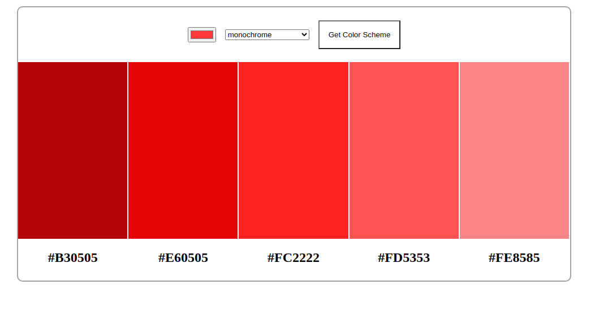

# Color Scheme Generator

Find color schemes for your next website and project

**link to project** https://color-scheme-generatorv1.netlify.app/

## How It's Made:

**Tech used:** HTML, CSS, JAVASCRIPT

## Lessons Learned:

- working with APIs, this is the API used for this project https://www.thecolorapi.com/docs
- About HTTP Request, endpoints, methods, how to fetch api
- REST API's resources, paramters and queries.
